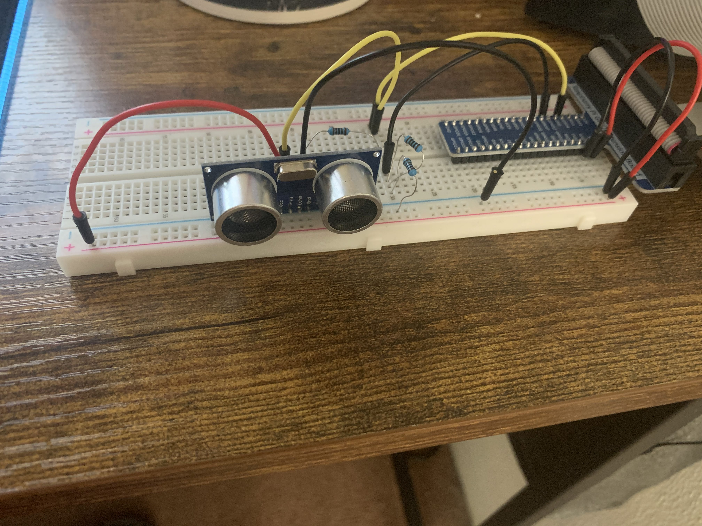
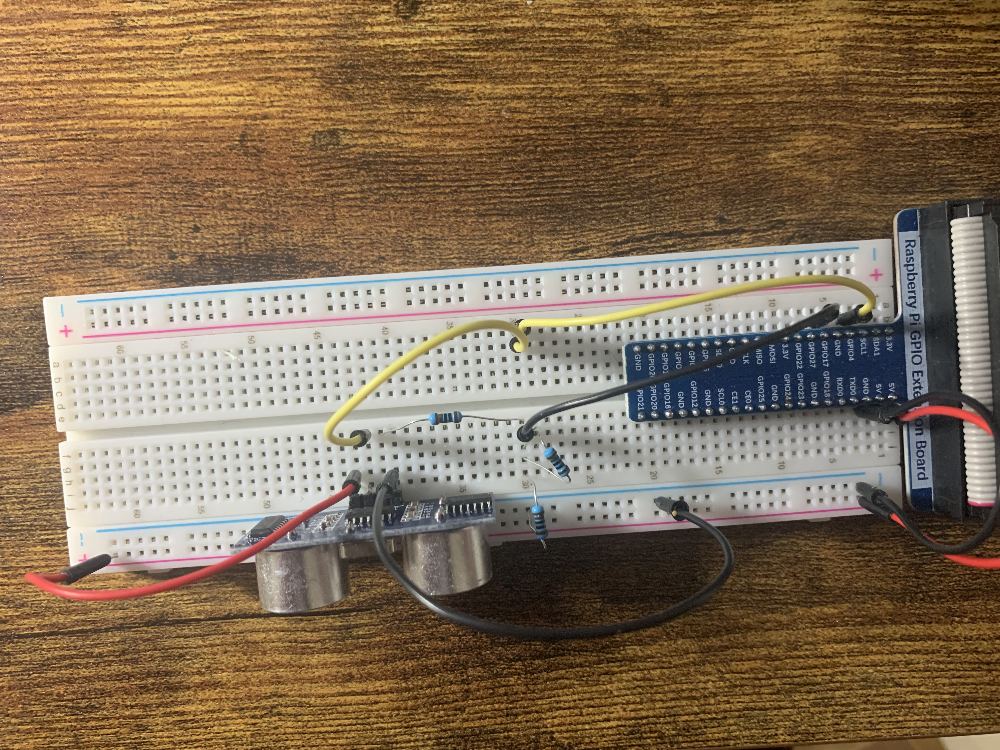

# HC-SR04

The HC-SR04 sensor is not a distance / motion detector, but an ultrasonic sensor. Through a small trick it is nevertheless possible to measure distances. By measuring the time elapsed between transmitting and receiving an ultrasound signal, you can derive the distance as the sound velocity in the air is known. 
You can try the example code and improve it according to your needs.

