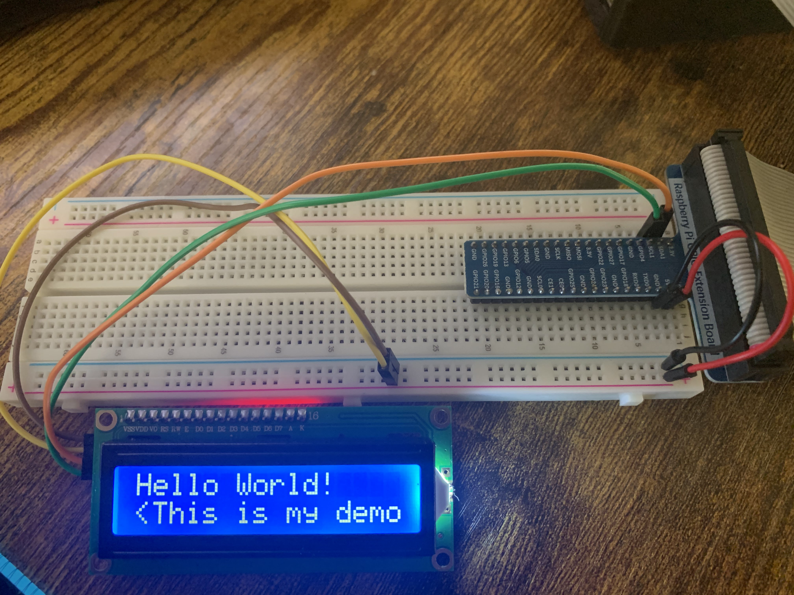

# LCD 

In this part, I try to show how to use LCD in RaspberryPi. It allows us to display digits or characters. For more information, you can check <a href="https://www.recantha.co.uk/blog/?p=4849" target="_blank" >this</a> website.

