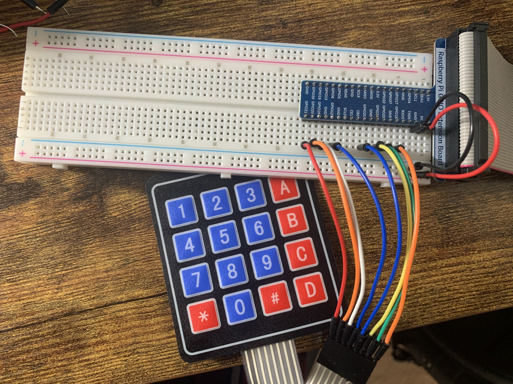

# 4x4 Universial 16 Key Switch Keypad Keyboard 

In this part, I try to show how to use the keypad in Raspberry Pi. This keypad allows us to code locks or for the construction of a small pocket calculator. Button A allows us to accept the input and, button C is to clear the input value.

