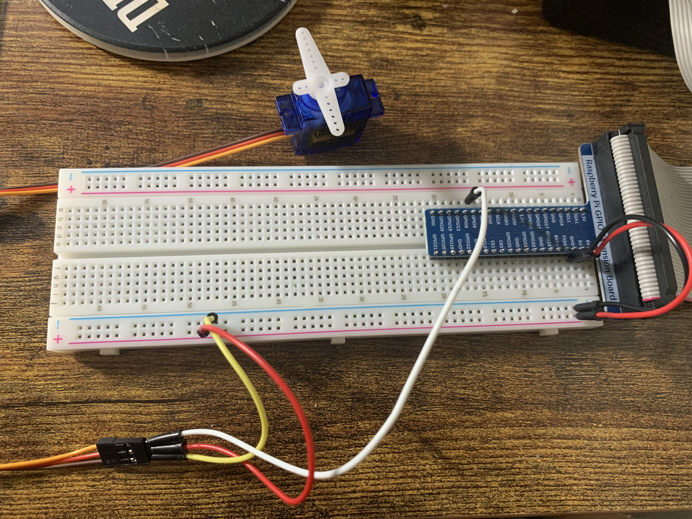

# Micro Servo SG90

Unlike ordinary motors, servo motors can be individually controlled. Only the indication of the angle of rotation for moving the motor is necessary. PWM (pulse width modulation) signals are sent to the motor. The Raspberry Pi can use this method of transmission. Using the Python GPIO library or WiringPi is particularly easy. In this example I used GPIO library.

