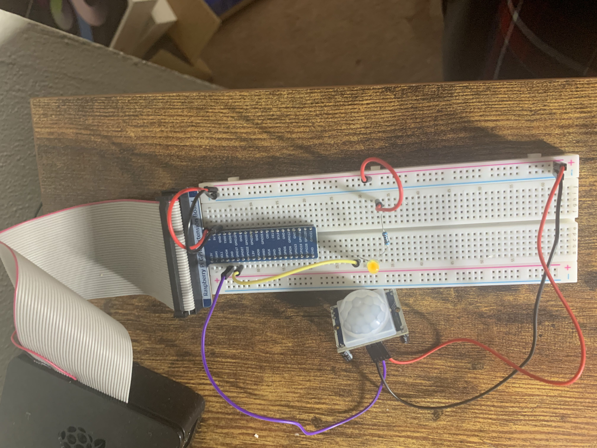

# PIR Motion Sensor

The PIR motion sensor has some advantages over other similar products: besides the low price, a signal is sent only if something moves. This allows you to wait for signal flanks using the GPIOs. In addition, a resistance can be varied so that a signal is only sent when the movement is close, or changes that are already far away are perceived.
In addition to outdoor projects, the PIR can also be used in buildings – whether to activate the lighting or, as I use it, to turn on my touch screen for home automation as soon as someone approaches it.

