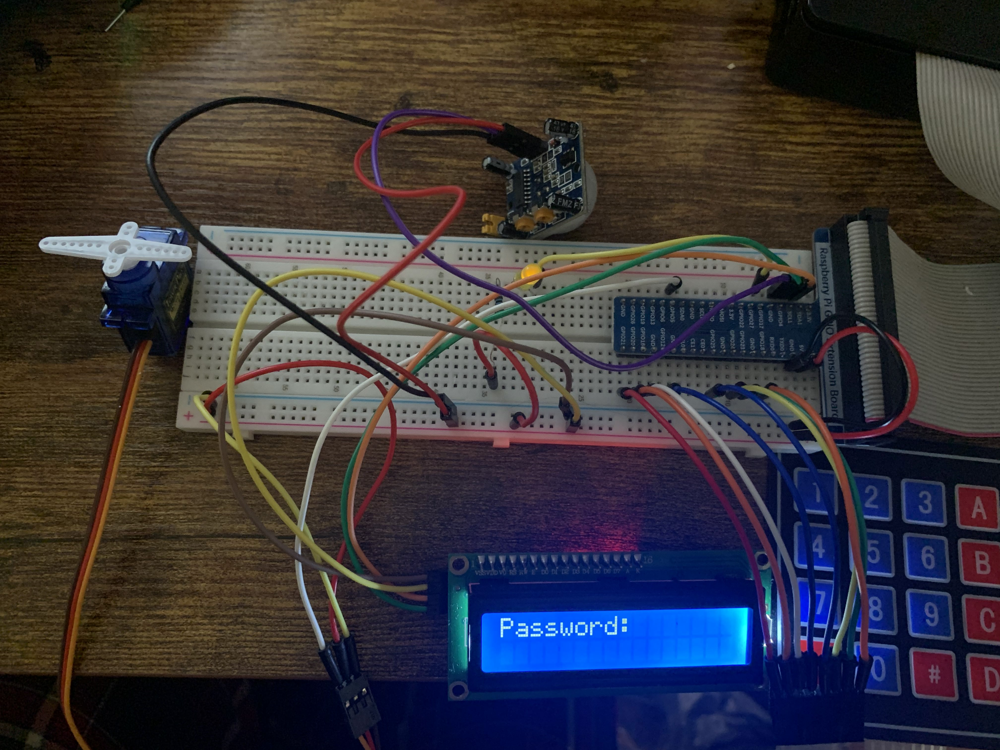

# Door Lock Simulation

This project aims to create a door lock simulation. PIR motion sensor waits for motion detection. When It detects a motion, the program activates the display screen and allows you to enter the password. If you can't enter the correct password in 20 seconds program deactivates the display and again waits for the motion. On the other hand, If you enter the right password, the micro servo will start running.

